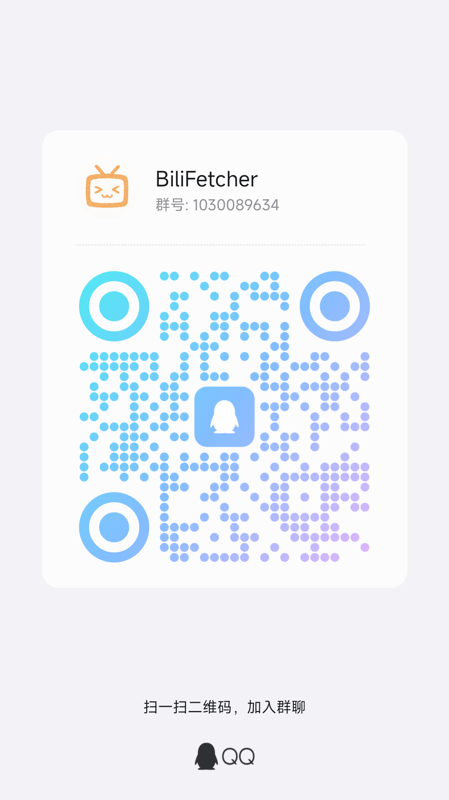

<p align="center">
    
</p>

<div align="center">
    <h1>BilibiliHistoryFetcher - 哔哩哔哩历史记录获取与分析工具</h1>
    
    
    
    
    
    
    
    

</div>

## 介绍
该项目用于获取、处理、分析和可视化哔哩哔哩用户的观看历史数据。它提供了完整的数据处理流程，从数据获取到可视化展示，并支持自动化运行和邮件通知。

## 零基础快速运行（Windows 免安装版，推荐）

1. 下载 exe：后端 https://github.com/2977094657/BilibiliHistoryFetcher/releases/latest
2. 下载 exe：前端 https://github.com/2977094657/BiliHistoryFrontend/releases/latest
3. 两个都双击运行即可

## 配套前端
请前往此项目 [BiliHistoryFrontend](https://github.com/2977094657/BiliHistoryFrontend) 获取配套的前端界面

## 主要功能

- [x] 获取历史记录
- [x] 年度总结
- [x] 视频和图片下载
  - [x] 一键下载用户所有投稿视频
- [x] 用户动态下载
- [x] 自动化任务
- [x] 获取用户评论
- [x] 获取收藏夹
  - [x] 批量收藏
  - [x] 一键下载收藏夹所有视频
- [x] 获取互动记录
  - [x] 获取历史记录时自动同步收藏/点赞/投币记录
  - [x] 将互动数据补充到年度总结分析
- [x] 最多找回14天内b站所有在屏幕上显示过的图片

## 后续开发计划

项目正在积极开发中，您可以在我们的 [GitHub 项目计划页面](https://github.com/users/2977094657/projects/2) 查看最新的开发路线图和即将实现的功能。

## 交流群

如果您在使用过程中有任何问题或想与其他用户交流使用心得，欢迎加入我们的QQ交流群[1030089634](https://qm.qq.com/q/k6MZXcofLy)：

<p align="center">
    
</p>

## 系统要求

- Python 3.10+
- SQLite 3
- FFmpeg（用于视频下载）
- 必要的 Python 包（见 requirements.txt）

## 快速开始

#### 使用 Docker 安装
由 [@eli-yip](https://github.com/eli-yip) 实现 ([#30](https://github.com/2977094657/BilibiliHistoryFetcher/pull/30))
1. 安装 [Docker](https://docs.docker.com/get-started/get-docker/)
2. 拉取预构建镜像（推荐）：
   ```bash
   # CPU 基础版
   docker pull ghcr.io/lifearchiveproject/bili-history-fetcher:latest
   docker run -d -v ./config:/app/config -v ./output:/app/output -p 8899:8899 --name bilibili-api ghcr.io/lifearchiveproject/bili-history-fetcher:latest
   ```

   提示：仓库迁移到 `LifeArchiveProject` 后，后端镜像使用 `ghcr.io/lifearchiveproject/bili-history-fetcher`。`ghcr.io/2977094657/...` 属于历史个人账号命名空间，不再作为推荐安装来源。

   如果拉取 `ghcr.io/lifearchiveproject/...` 提示 `denied` 或 `unauthorized`，请在 GitHub Packages 中将对应容器包的 visibility 调整为 Public。GHCR 新发布的容器包默认可能是 Private，公开后才能匿名拉取。

   标签说明：
   - CPU：`latest` 或 `vX.Y.Z`
   - 平台：目前仅提供 `linux/amd64`

3. 从源码构建镜像（可选）：
   ```bash
   # 使用 CPU
   docker build -t bilibili-api:dev -f docker/Dockerfile.cpu .
   ```
4. 创建 Docker 容器（源码构建后的镜像）：
   ```bash
   # 使用 CPU
   docker run -d -v ./config:/app/config -v ./output:/app/output -p 8899:8899 --name bilibili-api bilibili-api:dev
   ```

   挂载目录说明：
   - `./config:/app/config`：配置文件目录，用于存储 SESSDATA 和其他配置
   - `./output:/app/output`：输出目录，用于存储下载的视频、图片和生成的数据

#### 使用 Docker Compose 部署

本项目提供了 Docker Compose 配置，实现一键部署前后端服务。

1. 确保已安装 [Docker](https://docs.docker.com/get-started/get-docker/) 和 [Docker Compose](https://docs.docker.com/compose/install/)

2. 下载 `docker-compose.yml` 文件（CPU 基础版）：
   - 直接从[这里](https://raw.githubusercontent.com/LifeArchiveProject/BilibiliHistoryFetcher/master/docker-compose.yml)下载
   - 或使用以下命令下载：
      ```bash
      curl -O https://raw.githubusercontent.com/LifeArchiveProject/BilibiliHistoryFetcher/master/docker-compose.yml
      # 或
      wget https://raw.githubusercontent.com/LifeArchiveProject/BilibiliHistoryFetcher/master/docker-compose.yml
      ```

3. 使用 Docker Compose 启动服务：
   ```bash
   # CPU 基础版
   docker-compose up -d
   ```

4. 服务启动后访问：
   - 前端界面：http://localhost:5173
   - 后端API：http://localhost:8899
   - API文档：http://localhost:8899/docs

#### [通过 1Panel 部署](https://github.com/2977094657/BilibiliHistoryFetcher/discussions/65)
由社区贡献者 [@QYG2297248353](https://github.com/QYG2297248353) 实现 ([#66](https://github.com/2977094657/BilibiliHistoryFetcher/pull/66))

#### 使用 uv 安装
由社区贡献者 [@eli-yip](https://github.com/eli-yip) 实现 ([#30](https://github.com/2977094657/BilibiliHistoryFetcher/pull/30))

1. 安装 [uv](https://docs.astral.sh/uv/getting-started/installation/)
2. 在项目根目录运行：
   ```bash
   # 安装依赖
   uv sync
   ```

   ```bash
   # 运行程序
   uv run main.py
   ```

#### 使用传统 pip 方式安装

如果您更喜欢使用传统的 pip 作为包管理器，可以按照以下步骤操作：

1. **安装依赖**

```bash
pip install -r requirements.txt
```

2. **运行程序**
```bash
python main.py
```

## API 接口

基础 URL: `http://localhost:8899`

完整 API 文档访问：`http://localhost:8899/docs`

## 通知配置

- 设置页支持邮件配置和 Apprise 推送配置
- `config/config.yaml` 的 `apprise.urls` 支持多个 URL，每行一个。
- 计划任务出错和 SESSDATA 失效时会同时触发邮件和 Apprise 推送。

## MCP 局域网只读服务

项目内置一个只读 MCP 服务，方便局域网内的其他 AI 客户端读取本地 B 站历史记录、统计分析、视频详情和任务状态。MCP 默认复用现有 FastAPI 服务，地址为：

```text
http://<服务所在机器IP>:8899/mcp/
```

配置位于 `config/config.yaml` 的 `server.mcp`：

```yaml
server:
  mcp:
    enabled: true
    path: "/mcp"
    auth_enabled: true
    token: "替换为你的随机token"
    max_page_size: 100
```

客户端需要携带请求头：

```text
Authorization: Bearer <token>
```

也可以通过环境变量 `BHF_MCP_TOKEN` 覆盖配置文件中的 token，适合不想把 token 写入配置文件的部署方式。

MCP v1 只开放读取能力，包括项目状态、可用年份、历史记录分页查询、历史搜索、年度总结、观看行为分析、标题分析、互动记录、视频详情、计划任务状态和数据健康报告。同步、下载、删除、登录、重置数据库、配置修改等有副作用的能力不会通过 MCP 暴露。

内置 Resources：
- `bili://project/overview`：项目能力概览。
- `bili://project/tool-guide`：MCP 工具使用指南。
- `bili://project/data-status`：当前数据目录和可用年份状态。
- `bili://project/privacy-policy`：隐私、脱敏和禁止操作说明。

常用 Tools：
- `get_project_status`、`list_available_years`
- `query_history_records`、`search_history_records`、`get_history_by_cid`
- `get_daily_count`、`get_annual_summary`、`get_viewing_analytics`、`get_title_analytics`
- `get_interaction_summary`、`query_interaction_records`、`get_interaction_status`
- `get_video_detail`、`search_video_details`、`get_video_detail_stats`
- `get_scheduler_tasks`、`get_scheduler_history`
- `get_data_integrity_report`、`get_sync_result`、`get_local_data_inventory`

### 互动记录补充

获取历史记录时会自动补充同步收藏、点赞、投币记录，用于缓解 B 站观看历史仅保留近三个月的问题，并将可用互动数据加入年度总结分析。补充记录会在 SQLite 历史记录导入完成后一次性写入主历史库，前端历史记录页可以看到，标记为“互动补充”，备注会注明来源是收藏、点赞或投币。

计划任务调用现有的历史记录获取/导入链路，因此也会触发互动记录补充。系统会检测主历史库中是否已存在“互动补充”记录，并记录导入状态；一旦导入过，后续同步和计划任务都会跳过，不会重复写入。

说明：收藏夹内容接口支持分页并返回 `fav_time`，系统会不限年份同步所有可访问收藏内容；投币 Web 接口会返回已返回记录的投币时间；点赞 Web 接口主要是最近点赞视频列表，当前未发现可靠的全量历史分页和点赞时间字段。B 站用户信息接口中的注册时间字段当前文档说明通常返回 `0`，因此无法可靠按账号注册时间作为全量起点。

## 数据迁移指南

**核心结论：迁移时只需要拷贝整个 `output` 目录到新环境即可。**

适用场景：同机路径迁移、跨机器迁移、Docker/Compose 部署、打包版/本地运行。

步骤：
- 停止正在运行的服务（本地进程或容器）。
- 备份 `output` 整个文件夹（直接拷贝或压缩打包）。
- 在新环境放置/挂载：
  - 本地运行（uv/pip）：将 `output` 放到项目根目录下，使路径为 `./output`。
  - Docker 运行：使用 `-v <本地output路径>:/app/output` 挂载；或在 `docker-compose.yml` 中将本地 `output` 目录映射到容器 `/app/output`。
  - 打包版运行：将 `output` 放置在可执行文件同级目录的 `output` 文件夹中。
- 启动服务并验证数据是否就绪（历史记录、统计与可视化应能正常展示）。

注意：
- 认证信息与运行配置位于 `config/`，不属于数据迁移范畴；新环境需按需填写 `config/config.yaml`（如 `SESSDATA` 等）。
- Linux 环境请确保对 `output` 目录有读写权限（Docker 场景关注宿主机目录权限/属主）。

## output 目录说明

`output` 目录包含所有持久化数据与可再生成数据，迁移只需拷贝此目录：

- `bilibili_history.db`：主历史记录数据库。
- `video_details.db`：视频详情数据库。
- `image_downloads.db`：图片下载记录数据库。
- `database/`：业务分库集合（如 `bilibili_comments.db`、`bilibili_dynamic.db`、`bilibili_favorites.db`、`bilibili_interactions.db`、`bilibili_popular_2025.db`、`bilibili_video_details.db`、`scheduler.db`）。
- `history_by_date/YYYY/MM/DD.json`：按日期归档的观看历史快照。
- `api_responses/`：原始 API 响应缓存（便于重放/排错）。
- `analytics/` 与根目录下的 `daily_count_*.json`、`monthly_count_*.json`：统计汇总结果。
- `download_video/`：已下载的视频内容及相关封面/海报等资源。
- `images/`：用户头像、封面及孤立资源缓存。
- `cache/image_proxy/`：图片代理缓存（可再生成）。
- `comment/`：用户评论原始数据。
- `dynamic/`：动态相关原始数据/缓存。
- `logs/YYYY/MM/`：运行日志，便于排错与审计。
- `state/sessdata_monitor.json`：会话状态监控信息（非敏感数据）。
- `last_import.json`：最近一次导入/同步状态记录。
- `heatmap_comparison.html`：热力图对比可视化产物。
- `temp/`、`tmp_video/`：运行期临时文件（可清理）。

## 应用打包

本项目提供了自动化打包脚本，可以将应用打包成独立的可执行文件，便于分发和部署。打包过程会自动处理依赖并清理敏感信息。

**打包前准备**

确保已经安装了 PyInstaller：

```bash
pip install pyinstaller
```

**打包命令**

使用以下命令进行打包：

```bash
python build.py
```

**打包完成后**

- 输出目录：`dist/BilibiliHistoryAnalyzer/`

**敏感信息处理**

打包过程会自动处理配置文件中的敏感信息：

- 创建临时清理过的配置文件，替换以下敏感字段为示例值：
  - `SESSDATA`：替换为"你的 SESSDATA"
  - `email`：邮箱相关信息替换为示例邮箱地址和说明
  - `ssl_certfile`/`ssl_keyfile`：替换为示例路径
  - `api_key`：替换为"你的 API 密钥"

- 打包完成后，临时文件会被自动删除
- 打包版本中的配置文件包含原始结构但敏感字段被替换为示例值，用户需要首次运行时填写实际信息

**运行打包后的应用**

在目标系统上直接运行可执行文件：

```
# Windows系统
BilibiliHistoryAnalyzer.exe
```

## 缓存图片找回（近 14 天）

适用范围：找回 B 站 App 在过去最多 14 天内曾在屏幕上显示过的图片，包含但不限于：
- 视频封面
- UP 主头像
- 推荐页视频封面（含未点开）
- 评论区图片
- 动态图片
- 表情包
- 广告图片

手机端准备（MT 管理器）：
- 打开 MT 管理器，前往 `/storage/emulated/0/Android/data/tv.danmaku.bili/cache`
- 长按 `cache` 文件夹，选择“压缩”，生成一个 zip 压缩包

电脑端操作：
- 下载可执行文件 `BiliImagePipeline.exe`（Windows）：https://github.com/2977094657/BilibiliHistoryFetcher/releases/download/v1.6.5/BiliImagePipeline.exe
- 将手机导出的 `cache` 压缩包放到可执行文件所在目录（与 `.exe` 同级）
- 运行可执行文件，等待自动处理
- 处理完成后，在 `cache/ImagePipeLine/v2.ols100.1/by_date` 查看图片

查看与定位：
- 图片已按分辨率分组，视频封面通常集中在高分辨率文件夹，便于快速浏览
- 可按日期结构快速定位最近内容

已知问题：
- 小分辨率图片在资源管理器里可能无法预览（多见于表情、头像），使用浏览器打开可正常显示
- 14 天为缓存可取回的上限，超过时间窗口的内容通常已被系统清理，无法恢复
- 若无法直接从手机导出上述路径，请先在手机端完成压缩再拷贝 zip

## 贡献指南

1. Fork 项目
2. 创建特性分支
3. 提交更改
4. 发起 Pull Request

## 致谢

- [bilibili-API-collect](https://github.com/SocialSisterYi/bilibili-API-collect) - 哔哩哔哩-API 收集整理，本项目使用其 API 接口获取 B 站用户数据
- [Yutto](https://yutto.nyakku.moe/) - 可爱的 B 站视频下载工具，本项目使用其进行视频下载功能
- [ArtPlayer](https://github.com/zhw2590582/ArtPlayer) - 强大且灵活的 HTML5 视频播放器
- [aicu.cc](https://www.aicu.cc/) - 第三方 B 站用户评论 API
- 所有贡献者，特别感谢:
  - [@eli-yip](https://github.com/eli-yip) 对 Docker 部署的贡献
  - [@QYG2297248353](https://github.com/QYG2297248353) 对 1Panel 部署的贡献

## Star History

[](https://star-history.com/#2977094657/BilibiliHistoryFetcher&Date)
